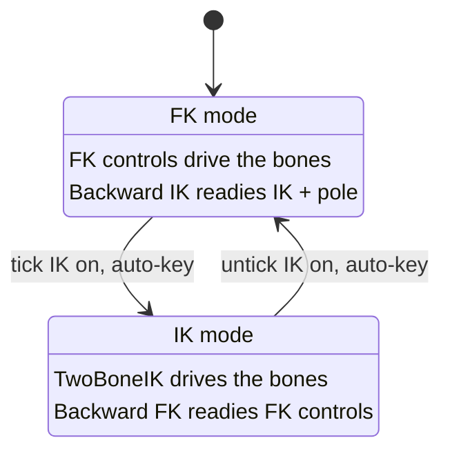
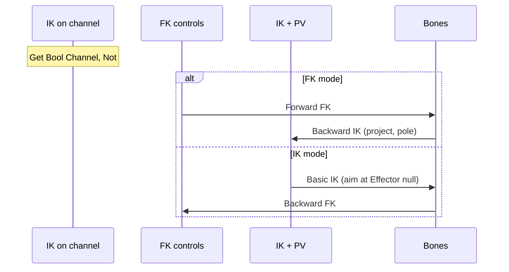
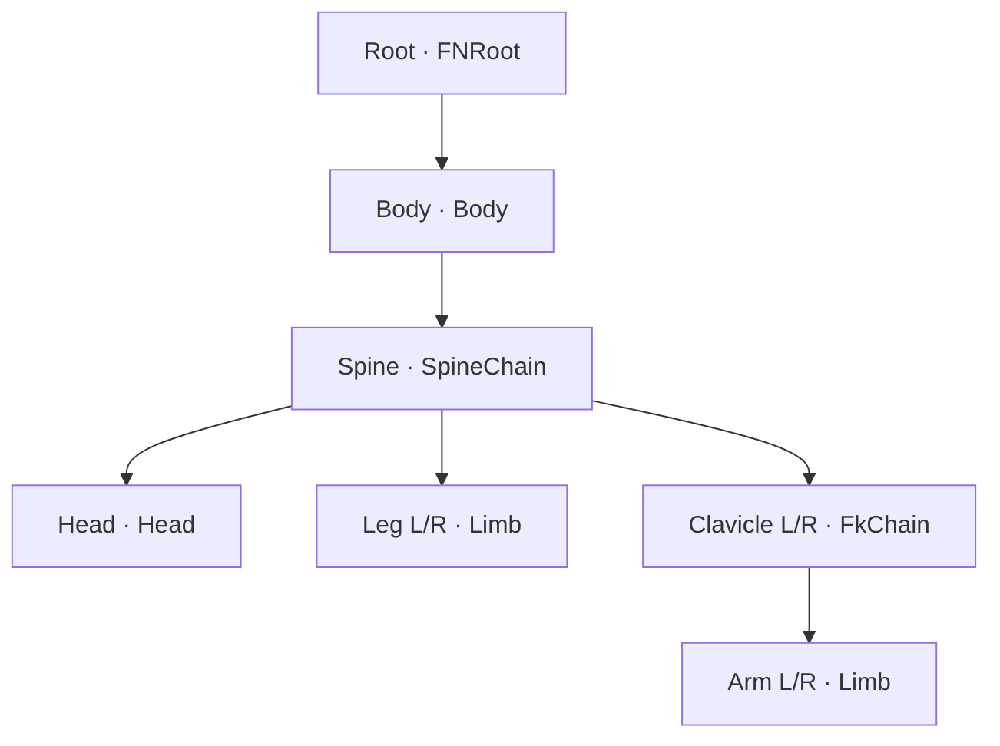

# Add Diagram (Mermaid, UML diagram types)

A diagram shows structure faster than prose: which modes exist and what moves between them, what
runs in what order, what connects to what. In this wiki a diagram is a ```` ```mermaid ```` block
inside the page. It is markdown, so it syncs with the vault and Obsidian draws it natively.
`llm-wiki-site` renders it to inline SVG in the DDC Reel look when `mmdc` is installed; otherwise
it stays a code block on the site.

Use the UML diagram **types** as the vocabulary. Don't use PlantUML: it needs Java and a plugin,
and Obsidian can't render it natively. Mermaid covers the UML types a wiki needs.

## When to draw one

Draw a diagram when the prose describes one of these, and a reader has to hold it in their head:

| The prose describes | Diagram | Mermaid |
|---|---|---|
| modes or states, and what moves between them (a switch, a lifecycle) | state | `stateDiagram-v2` |
| an order of calls, writes or messages between parts, one pass | sequence | `sequenceDiagram` |
| parts and how they connect (a tree, an assembly, a pipeline) | component | `flowchart TD` + `subgraph` |
| steps with branches or loops | activity | `flowchart TD` |
| types with fields and relations | class | `classDiagram` |
| events on dates | timeline | `timeline` |

Don't draw one when:
- a numbered list already is the structure (a straight run of steps);
- a table already shows it and nothing connects to anything;
- it would only decorate the page. One clear diagram beats three.

## Rules

1. **Top-down.** Use `flowchart TD` and the default top-to-bottom state layout. The site column
   is about 720px wide, so a wide left-to-right diagram gets scaled down until it's unreadable.
   Use `LR` only for 4 nodes or fewer in a row.
2. **About 12 nodes at most.** Split a bigger structure into two diagrams, or show one level only.
3. **The page's own words.** Use the exact names the page uses, and the Terminology table's
   words (`CLAUDE.md` → Writing Rule). A label runs at most about 30 characters per line; use
   `<br/>` for a second line. Keep state description lines under about 35 characters.
4. **Sequence participants are the things, messages are the operations.** Make the participants
   the data or parts that hold state (controls, bones, a channel, a service). The arrows are what
   happens to them (`Forward FK`, `Backward IK`). A diagram whose participants are the functions
   reads like a call graph, not a data flow.
5. **No claims the page doesn't make.** Every box and arrow has a sentence or a table row behind
   it on the page, or a `§` citation in the caption.
6. **Replace, don't duplicate.** If the diagram shows what a prose list or an ASCII drawing
   showed, remove that list or drawing. Keep a table when it carries detail the diagram doesn't.
7. **One caption sentence** right after the block: what to read from it, written to the Writing
   Rule. Example: "Each mode keeps the other side ready, so either flip lands on the pose already
   there."
8. **Monochrome.** The builder themes every diagram. Add no colors, except at most one
   `classDef accent stroke:#ff3300` on the one node the page is about (DDC Reel allows one accent
   per page). No emoji.

## Mermaid syntax traps

- Quote a label that has punctuation or parentheses: `Root["Root · FNRoot"]`, `B["Basic IK (aim)"]`.
- `end` is reserved in flowcharts: never use it as a node id (`End` or `EndNode` is fine).
- State descriptions: `state "FK mode" as FK`, then `FK : one line` for each line of text.
- Sequence: `alt FK mode` / `else IK mode` / `end`; `Note over A: text`.
- A `:` inside a flowchart label needs quotes.

## Procedure

1. Read the page. Pick the section whose prose describes the structure, and pick the type from
   the table above.
2. Write the block where the reader needs it: in that section, after its first line of prose. On
   a workshop or tutorial page, put it at the top of the phase it summarizes, after one lead-in
   line ("What Phases 2 and 3 build, one evaluation:").
3. **Check it renders** before saving. A snap-packaged `mmdc` can't see `/tmp`, so stage under
   your home folder:
   ```bash
   mkdir -p ~/.cache/llm-wiki-site/check && cat > ~/.cache/llm-wiki-site/check/d.mmd <<'EOF'
   stateDiagram-v2
     ...
   EOF
   mmdc -i ~/.cache/llm-wiki-site/check/d.mmd -o ~/.cache/llm-wiki-site/check/d.svg
   ```
   A non-zero exit is a syntax error: fix it. If `mmdc` isn't installed, say so and keep the
   diagram anyway (Obsidian still draws it).
4. Add the caption sentence. Remove what the diagram replaces (rule 6).
5. Set the page's `updated:` date. Append to `wiki/log.md`. Update the page's `index.md` summary
   only if its meaning changed.
6. Rebuild: `llm-wiki-site build .` (or `--site <wiki-id>`). The build must not print
   `mermaid: N diagram(s) left as code blocks`. Open the page and check that no label overruns
   its box.

## Examples (tested on the Moted Modules workshop wiki)

**State: a two-mode switch** (module page, under `## Forward`):



**Sequence: one evaluation of a solve** (workshop day, top of the phase):



**Component: an assembly tree** (concept page; it replaced an ASCII tree):



## Notes

- The builder caches each rendered diagram by its source text, so a rebuild only re-renders the
  diagrams that changed.
- Labels are measured and drawn in DejaVu Sans Mono, which the builder ships with any site that
  has a diagram. Don't restyle diagram text per page.
- For a visual that a diagram can't carry (motion, a derivation), use a concept widget or an
  explainer video instead (see Publish in `CLAUDE.md`).
